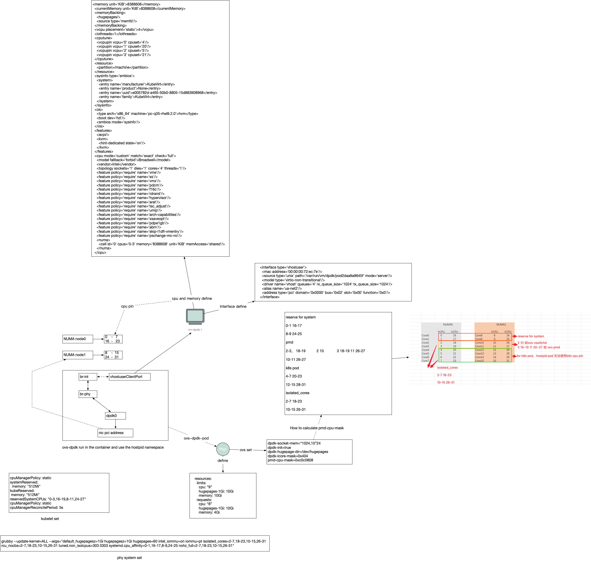
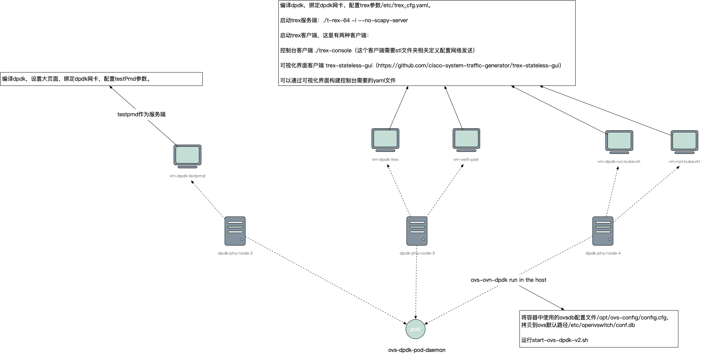

# Kubevirt Dpdk Support

The project is base from the kubevirt tag v1.0.0.

## Kube-ovn Dpdk Support
The version of the Kube-ovn must merge the [PR](https://github.com/kubeovn/kube-ovn/pull/3438).
## Kube-ovn Ovs Dpdk Daemonset 
Please look the [Kube-ovn dpdk deployment instructions](https://kubeovn.github.io/docs/v1.12.x/en/advance/dpdk/).
## Deploy Kubevirt Dpdk
You can find deploy files in the the repo ./deploy/
## Kubevirt Dpdk Node Config Suggest

## How To Test Dpdk Suggest

## Contact Me

Wechat: wujixinxin

Email: 599230270@qq.com